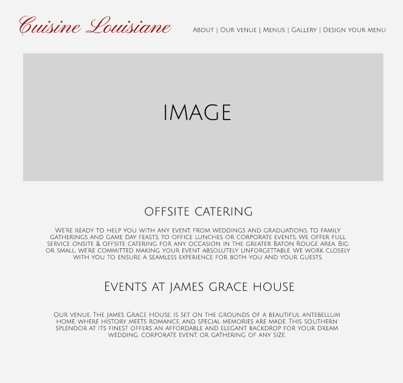
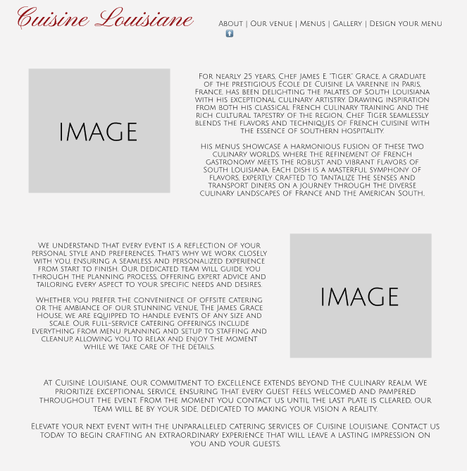
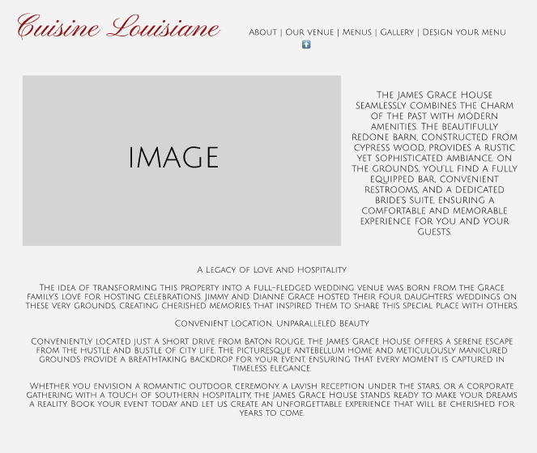
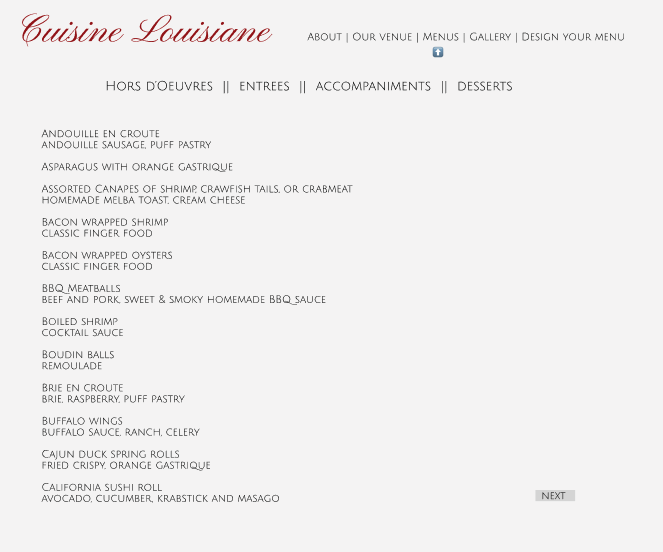
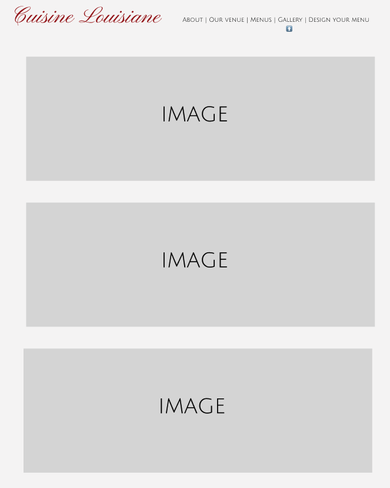
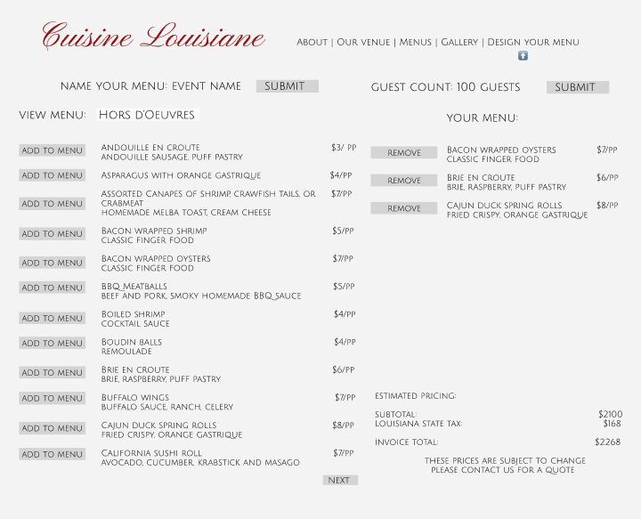
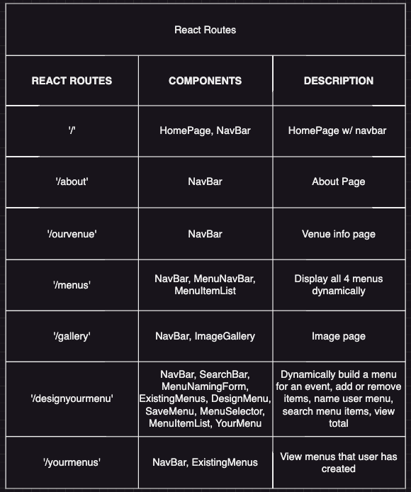
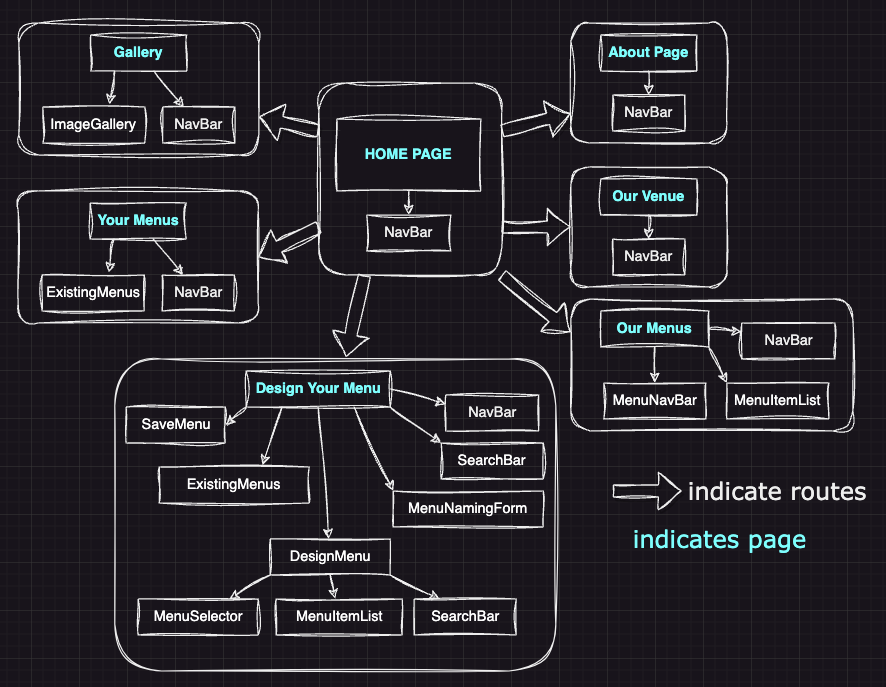
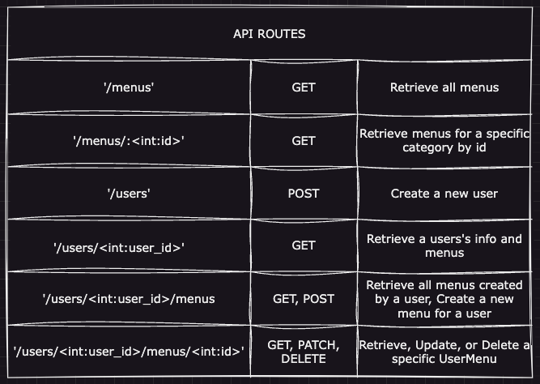
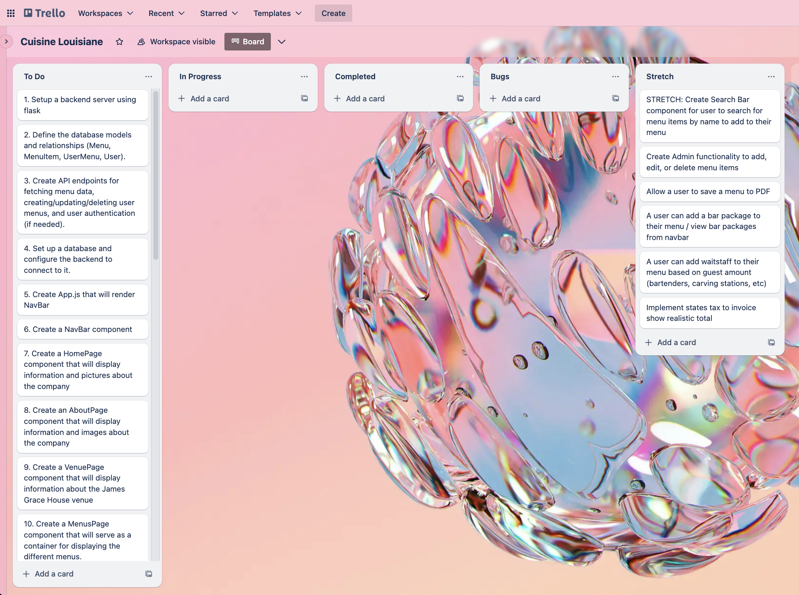

## Cuisine Louisiane

An app for Cuisine Louisiane catering company. A user can view menus, build their own menu for an event and see an invoice estimate.

## Getting Started
To get a local copy running, follow these steps:

1. Clone the repository


### Back-end installation


2. Navigate to the server directory:    
    
```bash
    cd server
```

3. Install pipenv and project dependencies: 

```bash    
    pipenv install
```

4. Activate the virtual environment: 
 
```bash   
    pipenv shell
```

5. Apply database migrations
    
```bash
    cd server
```
```bash
    flask db upgrade head
```
6. Populate the database with inital data
    
```bash
    python seed.py
```

7. Start the back-end server:

```bash
    python app.py
 ```
### Front-end installation

8. In a new terminal, navigate to the client directory:

```bash    
    cd client
```
9. Install npm packages:

```bash    
    npm install
```
10. Start the front-end development server:

```bash    
    npm run dev
```


## Deliverables

* A user can see menu items, and filter by category
* A user can view about information on the company and venue
* A user can choose menu items to build their own menu for an event
* A user can name their menu (Kate's Bridal Shower, etc)
* A user can edit their menu for an event
* A user can delete menu items from the menus that they build
* A user can view pricing updated dynamically based on event size (amount of people)


## Advanced Deliverables
* Admin page can add or delete menu items
* A user can choose to save a menu to a PDF
* A user can search menu items by name
* A user can add a bar package to their menu / view bar packages page from navbar
* A user can add waitstaff to their menu (by guest amount)
* A user can see a realistic invoice amount with tax added

## Wireframe







## React Routes


## React Component Tree


## Database Schema


## API Routes


## Kanban Board


## Resources

- [Setting up a respository - Atlassian](https://www.atlassian.com/git/tutorials/setting-up-a-repository)
- [Create a repo- GitHub Docs](https://docs.github.com/en/get-started/quickstart/create-a-repo)
- [Markdown Cheat Sheet](https://www.markdownguide.org/cheat-sheet/)
- [Python Circular Imports - StackAbuse](https://stackabuse.com/python-circular-imports/)
- [Flask-CORS](https://flask-cors.readthedocs.io/en/latest/)
