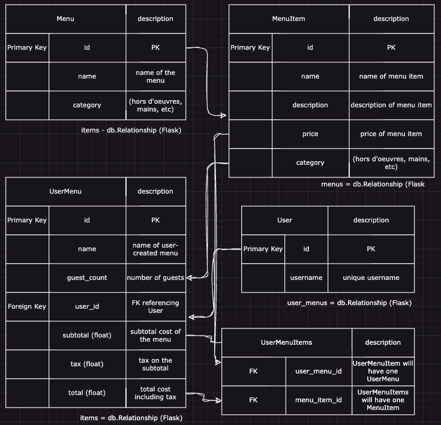

## Cuisine Louisiane

An app for Cuisine Louisiane catering company. A user can view menus, build their own menu for an event and see an invoice estimate.

## Deliverables

* A user can see menu items, and filter by category
* A user can view menu descriptions on a separate page (offerings? items?/id)
* A user can view about information on the company and venue
* A user can choose menu items to build their own menu for an event
* A user can delete menu items from the menus that they build
* A user can view pricing updated dynamically based on event size (amount of people)

## Advanced Deliverables
* Admin page can add or delete menu items
* A user can choose to save a menu to a PDF
* A user can search menu items by name
* A user can add a bar package to their menu / view bar packages page from navbar
* A user can add waitstaff to their menu (by guest amount)
* A user can see a realistic invoice amount with tax added

## Wireframe

## React Routes

## React Component Tree

## Database Schema

## Kanban Board

This README should serve as a template for your own- go through the important
files in your project and describe what they do. Each file that you edit (you
can ignore your migration files) should get at least a paragraph. Each function
should get a small blurb.

You should descibe your application first, and with a good level of detail. The
rest should be ordered by importance to the user. (Probably routes next, then
models.)

Screenshots and links to resources that you used throughout are also useful to
users and collaborators, but a little more syntactically complicated. Only add
these in if you're feeling comfortable with Markdown.

---

## Conclusion

A lot of work goes into a full-stack application, but it all relies on concepts
that you've practiced thoroughly throughout this phase. Hopefully this template
and guide will get you off to a good start with your Phase 4 Project.

Happy coding!

---

## Resources

- [Setting up a respository - Atlassian](https://www.atlassian.com/git/tutorials/setting-up-a-repository)
- [Create a repo- GitHub Docs](https://docs.github.com/en/get-started/quickstart/create-a-repo)
- [Markdown Cheat Sheet](https://www.markdownguide.org/cheat-sheet/)
- [Python Circular Imports - StackAbuse](https://stackabuse.com/python-circular-imports/)
- [Flask-CORS](https://flask-cors.readthedocs.io/en/latest/)
